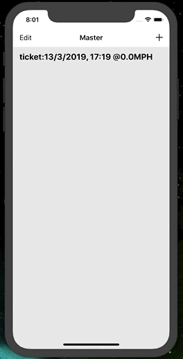

# SwiftySwiftDarkMode

Dark Mode was introduced to MacOS on the Mohave update. A popular feature that came with it was Dark Mode, which changes the color scheme that is more pleasant to the eyes later in the day. In my option I also believe it looks more asthetic in general and I have my MacBook always on Dark Mode. 

Here, I implement my own version of a customizable Dark Mode for in Swift with a simulation on an iPhone X. 

## Illustration

## Details
- iOS 11+
- Xcode 10+
- Swift 4+
